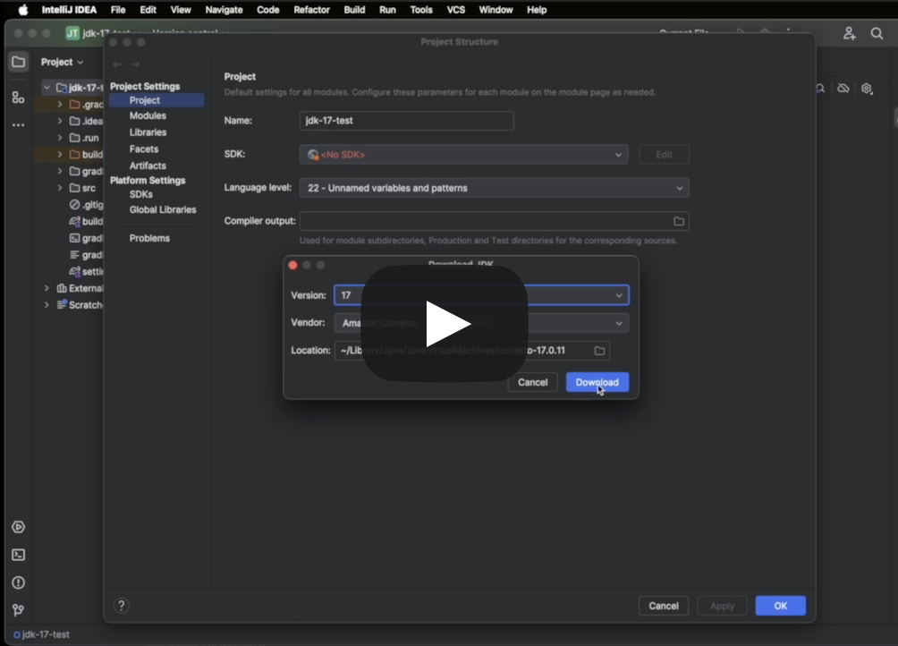

# Assessment 3 (2025)

* Each assignment must be the sole work of the student who received it.
* Assignment will be closely monitored, and students may be asked to explain any suspicious similarities with any piece of code available.
* When you submit an assignment that is not your own original work you will get Zero _(we have some tools to identify plagio)_.

Before trying to execute anything, please configure this project to use <u>Java 21</u>.

To achieve that you can follow this video link:

  

<small style="color: #ccc"><i><b style="color: red">Note</b>: Please skip the part after 0:35.</i></small>

This assignment contains an _embedded evaluation application_ which will allow you to see your progress in real-time. You will need **Docker**
and a (recent) version of **IntelliJ** (some help [here](https://gitlab.estig.ipb.pt/dsys/ds-classes/-/wikis/first-steps)).

To start the assessment perform the following steps:

* There's a `docker-compose.yml` file on the root of this project containing the service(s)
  needed for the assessment. We advise the use of the terminal - the *bot* inside may send useful information to the console, you can start it by performing:
  * `cd` to the project's **root directory**;
    
Right-click on the project's root in IntelliJ and "Copy Path/Reference" > "Absolute Path"

  * `docker compose up`
* Use your browser to open this url - http://localhost:8989 - if all went well, you should see the assessment information
  and the completion status of each step.
  On the lower left there's a message panel, and on the right, a status log (with useful information to diagnose your progress).
* The submission button will become enabled when all steps are complete.
* In the chance of a problem submitting, use the Download ZIP option to download the *deliverable* zip file and reach out to the teachers.

If you encounter this issue, please disable your firewall momentarily.

Make sure you write all your conde under the `src/main/java` under the already created package `pt.ipb.dsys.assessment.three`.

The `Gossip Router`, alongside an `insider` member of the cluster, are already running on the `docker` container you started earlier,
listening on `127.0.0.1:12001`, **<u style="color: red">you don't need to start the gossip router yourself!</u>**.

The cluster name is `cluster-59440`. 

The next section describes the implementation details you need to achieve in order to complete the assignment.

# Add and Multiply
# Objective

Design and implement a simple distributed calculator with the help of `JGroups`.

# Description

Inside the `src` of the project you will find the package `pt.ipb.dsys.assessment.three` containing two classes -
`Peer1Main` and `Peer2Main`. 

Complete these classes, to implement the necessary code to create and connect a `channel` (`JChannel`) to the
gossip router at `127.0.0.1:12001`and the cluster named `cluster-59440`, for better results use the following guidelines:
- Before creating the `channel` invoke `PeerTools.prepare()` - this solves a bug related to the Windows network stack;
- Use the method `PeerTools.protocols(String, int)` to preconfigure the `PROTOCOLS` needed by `JChannel`;
- Configure each member's `channel` to discard its own messages;
- Write a different `Receiver` class (`org.jgroups.Receiver`) for each of the `Peer*Main` programs <i style="color: gray">(details below)</i>;
- <b style="color: gray">[OPTIONAL]</b>: To keep both members running, instead of the `while(true) ...` exemplified in class, invoke the `PeerTools.waitFor(JChannel)`
  method;
  
<b>WARNING</b>: Killing the application with the IDE's stop button may cause unexpected behavior due 
  to unresolved connections.

  
If you experience problems, try restarting both programs and the docker container.

Each member performs only a specific mathematical operation:
- One member performs `add` (`+`) operations; 
- Another member performs `multiplication` (`*`) operations. 

After successful connection of both members, and upon clicking the **Start Activity &triangleright;** button, the `insider`, the following is expected:
- The `insider` member will send an `"OP"` message to each member to which they should respond (directly) with the operation they support (`+` and `*`);
- Upon receiving both confirmations, the `insider` will send 2 random numbers (`double[]`) to each member;
- Each member must perform it's operation between the two numbers (in order), persist the answer and broadcast it to the cluster;
  
This answer will be needed later.

- Upon receiving the other's number (broadcast), the member must perform its operation between the previously persisted value and the received value (ex.: `finalResult = {presisted} + {received}`;
- Broadcast a `String` containing <u>exactly</u> the text `"report: {finalResult}"` (ex.: `report: 12345`). 
 

**Good Luck!**
