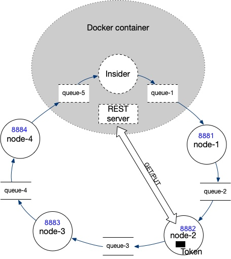

# Assessment 4 (2025)


* Each assignment must be the sole work of the student who received it.
* Assignment will be closely monitored, and students may be asked to explain any suspicious similarities with any piece of code available.
* When you submit an assignment that is not your own original work you will get Zero _(we have some tools to identify plagio)_.


Before trying to execute anything, please configure this project to use <u>Java 17</u>.

To achieve that you can follow this video link:

<div >
  <a href="https://cloud.ipb.pt/seafhttp/f/d7eccbf5138946d9be62/?op=view"></a>
</div>
<small style="color: #ccc"><i><b style="color: red">Note</b>: Please skip the part after 0:35.</i></small>


This assignment contains an _embedded evaluation application_ which will allow you to see your progress in real-time. You will need **Docker**
and a (recent) version of **IntelliJ** (some help [here](https://gitlab.estig.ipb.pt/dsys/ds-classes/-/wikis/first-steps)).

To start the assessment perform the following steps:

* There's a `docker-compose.yml` file on the root of this project containing the service(s)
  needed for the assessment. We advise the use of the terminal - the *bot* inside may send useful information to the console, you can start it by performing:
  * `cd` to the project's **root directory**;
    <div style="color: #aaa; font-style: italic; font-size: 0.9em">Right-click on the project's root in IntelliJ and "Copy Path/Reference" > "Absolute Path"</div>
  * `docker compose up`
* Use your browser to open this url - http://localhost:8989 - if all went well, you should see the assessment information
  and the completion status of each step.
  On the lower left there's a message panel, and on the right, a status log (with useful information to diagnose your progress).
* The submission button will become enabled when all steps are complete.
* In the chance of a problem submitting, use the Download ZIP option to download the *deliverable* zip file and reach out to the teachers.

If you encounter this issue, please disable your firewall momentarily.


The assignment requires you to implement a system for distributed mutual exclusion based on the token ring algorithm (Figure 1). 

 

Figure 1 - Generic architecture

The communication channel is unique between each two nodes and must be implemented with a message queue.
The **critical region** is simulated with a REST service, implemented inside the docker container, that exposes an internal resource (a `double` number).
The access to the **critical region** should be performed by a single node at a time and only when in the possession of a `token`.

In addition, each node will be selected by a call (`POST`) to a `REST` endpoint listening in the node, and  
should <b style="color: red">only read/update</b> the critical region if selected.
Otherwise, the critical region should **not** be updated.

The critical region access is simulated with an HTTP `GET` request to get the value (`read`),
a local (node) operation to change the value (based on the description below),
and a `PUT` request to change the value back in the `REST` service.


The project contains the following files/packages:

* `src/main/java/pt/ipb/dsys/assessment/four/*` - contains a set of packages which you will use to implement four 
  `SpringBoot` applications with an `ActiveMQ producer` and `ActiveMQ consumer`; 
* Each of the `*Main` classes is located in a sub-package: `app1`, `app2`, `app3` and `app4`;
* You will have to execute **all** of these (`App1Main`, `App2Main`, `App3Main` and `App4Main`) to complete the ring;
* The `token` is a JSON string with the format `{"token":"<the token>"}` (optionally represented by the `pt.ipb.dsys.assessment.four.model.Token` class);
* Each `App{N}Main` class starts a spring web container at port `888{N}` (ex.: `App1Main` runs on `8881`).

The `ActiveMQ Broker`, along side the `queue-1` and `queue-5` queues will already running on the `docker` container you started earlier listening on
`tcp://127.0.0.1:61616`, **<u style="color: red">you don't need to start a docker yourself!</u>**.

The next section describes the implementation details you need to achieve in order to complete the assignment.

> <b>Hints</b>:
> - It's always a good idea to stop all other docker containers to avoid port clash!
> - Each `App{N}Main` class registers a `node.id` property which can be *autowired* in a component class with:
> ```java
> @Value("${node.id}")
> private int nodeId;
> ```
>   <small style='padding-left: 2em'><i>This can be useful to write generic components (controllers, services, ...) for all `App{N}Main`</i> instead of individual.</small> 


# Ring Divide

On the `src` of the project you will find the package `pt.ipb.dsys.assessment.four.*` containing 4 `app[1-4]` packages and two additional packages.

Inside, each of the `App{N}Main.main(...)` methods, bootstraps one `SpringBoot` application for the `{N}` node.

To start the rings, click the `Start Activity ▶` on the right side of the page at http://127.0.0.1:8989/.

At each ring, the `Insider` node will:
- Select a random node to access the critical section by executing a `POST` request to `http://127.0.0.1:888{N}/select` with the payload:
```json
{
  "electionKey": "..."
}
```
- Place the `token` in the `queue-1` to start the ring.

Implement the additional code _(components)_ to:

* support a `REST` endpoint at `http://localhost:888{N}/select` that receives the election key;
  * Store the election key, you'll need it further on;
* consume the token in the corresponding `queue-{N}`, 
* if and only if **this node was elected** to access the critical region:
  * Use the HTTP `GET` method to retrieve the value from `http://127.0.0.1:8989/api/resource`;
  * <b style="color: green">Divide</b> by `1.1` (locally) to the obtained value;
  * Use the `PUT` method to place the new value in the URL `http://127.0.0.1:8989/api/resource/{value}/{electionKey}`.
   <br><i style="color: #777; font-size: 0.9em">Where `{value}` is the new resource value and  `{electionKey}` is the received election key above.</i>
* forward the token to the next node.

The `Insider` process will try to run the ring 10 times and compare the expected value at the end.

To keep up with the status, a **Status Log** area is provided.

<font size="5">**Good Luck!**</font>
